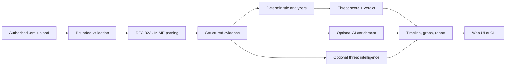

<div align="center">

# SENTINEL

### Evidence-first email threat detection for modern SOC investigations

<p>
  <a href="https://github.com/shaaannn7/sentinel"></a>
  <a href="https://github.com/shaaannn7/sentinel/issues"></a>
  
  
  
  
</p>

<p>
  
</p>

<p><strong>Turn suspicious email into a structured, explainable investigation.</strong></p>

<p>
  <a href="#quick-start">Quick start</a> ·
  <a href="#how-it-works">How it works</a> ·
  <a href="#api-at-a-glance">API</a> ·
  <a href="#security-model">Security</a> ·
  <a href="#contributing">Contributing</a>
</p>

</div>

---

## What is SENTINEL?

SENTINEL is an open-source SOC investigation platform for analyzing suspicious
email messages. It accepts raw RFC 822/`.eml` files and turns them into a
defensible investigation containing parsed evidence, authentication results,
threat findings, delivery timelines, indicator enrichment, relationship graphs,
and an explainable threat score.

The platform is deliberately **deterministic first**: parsing and security
scoring remain the source of truth, while AI and machine learning provide
optional enrichment and explanations. That makes the result useful for analyst
triage without treating an opaque model prediction as a security decision.

> **Defensive-use notice:** Use SENTINEL only with email artifacts you are
> authorized to investigate. It is an analyst aid, not an autonomous incident
> response system.

## Why it is useful

| Capability | What it provides |
| --- | --- |
| **Email forensics** | Headers, MIME parts, body text, attachments, URLs, domains, IPs, and authentication results |
| **Evidence-first scoring** | Modular analyzers, bounded scoring, conservative verdicts, and a visible score breakdown |
| **Authentication analysis** | SPF, DKIM, DMARC results and alignment signals |
| **Threat intelligence** | Pluggable IP, domain, URL, and hash enrichment; mock providers work out of the box |
| **AI-assisted reasoning** | Structured header, URL, content, and correlation analysis with schema-validated evidence references |
| **Investigation graph** | Interactive relationships between senders, infrastructure, URLs, and extracted indicators |
| **Forensic timeline** | Reconstructed delivery hops plus analysis events |
| **Analyst interfaces** | Next.js web UI and a terminal CLI backed by the same API and investigation engine |
| **Demo mode** | Explore the platform locally without external API keys |

## Quick start

### Option 1: Docker Compose (recommended)

**Prerequisites:** Docker 24+ and Docker Compose 2+.

```bash
git clone https://github.com/shaaannn7/sentinel.git
cd sentinel
cp .env.example .env
docker compose up --build
```

Open these URLs after the services become healthy:

| Service | URL |
| --- | --- |
| SENTINEL web app | [http://localhost:3000](http://localhost:3000) |
| FastAPI service | [http://localhost:8000](http://localhost:8000) |
| Interactive API docs | [http://localhost:8000/docs](http://localhost:8000/docs) |
| OpenAPI schema | [http://localhost:8000/openapi.json](http://localhost:8000/openapi.json) |

Then choose **New Investigation**, upload an authorized `.eml` file, and open
the resulting investigation to inspect its score, evidence, graph, timeline,
and report.

Stop the stack with:

```bash
docker compose down
# Add -v when you intentionally want to remove PostgreSQL and upload volumes.
```

### Option 2: Local GUI launcher

The repository includes a small launcher that starts the API and web UI using
the same local investigation engine:

```bash
./sentinel gui
```

The launcher uses `127.0.0.1:8000` for the API and `127.0.0.1:3000` for the
web app. Stop it with `Ctrl+C`.

### Option 3: Terminal CLI

```bash
./sentinel cli --help
./sentinel cli analyze path/to/message.eml
./sentinel cli list
```

The shorter legacy form remains available:

```bash
./sentinel analyze path/to/message.eml
```

## How it works



The core request path is:

1. Validate the file type and size, then safely store the artifact.
2. Parse the message into structured headers, body parts, attachments, and indicators.
3. Run deterministic analyzers for headers, authentication, content, URLs, domains,
   IPs, attachments, and delivery timeline.
4. Persist the investigation and evidence in the configured database.
5. Optionally enrich the result with threat intelligence and schema-validated AI
   reasoning.
6. Present an explainable result through the web interface, CLI, and API.

AI is an explicit enrichment step. If no provider key is configured, SENTINEL
returns deterministic results and records AI enrichment as unavailable instead
of inventing a verdict.

## Architecture

SENTINEL is a modular monolith with a Next.js analyst interface and a FastAPI
service. PostgreSQL is the durable source of truth; Redis is available for
service health and future queue/worker workflows.

```text
sentinel/
├── apps/
│   ├── api/                    # FastAPI service and investigation engine
│   │   ├── app/api/routes/     # Health, investigations, and brain endpoints
│   │   ├── app/services/       # Parser, analyzers, scoring, timeline, storage
│   │   ├── app/brain/          # ML, memory, explainability, orchestration
│   │   ├── app/models/         # SQLAlchemy persistence models
│   │   └── app/tests/          # Backend tests and email fixtures
│   ├── desktop/                # Optional Electron launcher configuration
│   └── web/                    # Next.js 14 analyst UI
├── packages/                   # Shared types and UI building blocks
├── infrastructure/k8s/         # Helm chart for Kubernetes deployment
├── docs/                       # API, architecture, deployment, and security docs
├── docker-compose.yml          # Local API, web, PostgreSQL, and Redis stack
└── sentinel                    # GUI and CLI launcher
```

For deeper design details, see:

- [System architecture](docs/architecture/system.md)
- [Data flow](docs/architecture/data-flow.md)
- [API guide](docs/api/api.md)
- [Security threat model](docs/security/threat-model.md)
- [Kubernetes Helm chart](infrastructure/k8s/helm-chart/)

## Configuration

Copy `.env.example` to `.env` for local configuration. Demo mode requires no
external credentials.

| Variable | Purpose | Local default |
| --- | --- | --- |
| `DATABASE_URL` | SQLAlchemy database connection | SQLite in direct local runs; PostgreSQL in Docker |
| `REDIS_URL` | Redis connection | `redis://redis:6379/0` |
| `LLM_PROVIDER` | `openai`, `anthropic`, or `mock` | `mock` |
| `LLM_API_KEY` | Provider credential | empty |
| `LLM_MODEL` | Model name passed to the provider | `gpt-4o-mini` |
| `THREAT_INTEL_PROVIDER` | Threat intelligence adapter | `mock` |
| `THREAT_INTEL_API_KEY` | Threat intelligence credential | empty |
| `GEOLOCATION_PROVIDER` | Geolocation adapter | `mock` |
| `MAX_UPLOAD_SIZE` | Maximum upload size in bytes | `10485760` |
| `DEMO_MODE` | Enable synthetic/demo behavior | `true` |
| `STORE_RAW_EMAIL` | Retain the uploaded artifact | `true` |
| `UPLOAD_DIR` | Local artifact directory | `/tmp/sentinel/uploads` |
| `CORS_ORIGINS` | Comma-separated allowed browser origins | `http://localhost:3000` |

Never commit `.env` or provider credentials. Use a secret manager for shared
or production deployments.

## Development

### Backend

```bash
cd apps/api
python3.11 -m venv .venv
source .venv/bin/activate
pip install -r requirements.txt
pytest
```

Run the API directly from the repository root:

```bash
PYTHONPATH=apps/api python -m uvicorn app.main:app --reload --port 8000
```

### Frontend

In a second terminal:

```bash
cd apps/web
npm install
npm run dev
```

Useful frontend checks:

```bash
npm run type-check
npm run lint
npm test
npm run build
```

When running the frontend outside Docker, set `NEXT_PUBLIC_API_URL` if the API
is not available at `http://localhost:8000`.

## API at a glance

The complete, interactive contract is available at `/docs` while the API is
running. The most useful routes are:

| Method | Endpoint | Purpose |
| --- | --- | --- |
| `GET` | `/health` | Service health check |
| `POST` | `/api/v1/investigations` | Upload and analyze an `.eml` artifact |
| `GET` | `/api/v1/investigations` | List investigations |
| `GET` | `/api/v1/investigations/{id}` | Retrieve investigation details |
| `POST` | `/api/v1/investigations/{id}/analyze` | Rerun deterministic analysis |
| `GET` | `/api/v1/investigations/{id}/report` | Retrieve the explainable report |
| `GET` | `/api/v1/brain/status` | View model and memory status |
| `GET` | `/api/v1/brain/explain/{id}` | Explain the investigation verdict |
| `POST` | `/api/v1/brain/retrain` | Trigger model retraining |

Example upload with `curl`:

```bash
curl -X POST http://localhost:8000/api/v1/investigations \
  -H "accept: application/json" \
  -F "file=@path/to/message.eml;type=message/rfc822"
```

## Retraining the detection model

The ML brain is an enrichment layer; deterministic evidence and scoring remain
the safety authority. Retraining metadata records the dataset source, feature
schema, seed, metrics, and model hash.

```bash
cd apps/api
python -m app.brain.train --samples 3000 --evaluate --verbose
```

To mix generated threat samples with a cached public ham/spam corpus:

```bash
python -m app.brain.train \
  --download --real --real-limit 5000 \
  --samples 5000 --evaluate --verbose
```

Downloaded corpus files are local training inputs and are intentionally ignored
by Git. Review validation metrics before using a retrained model in production.

## Security model

SENTINEL is designed for untrusted email evidence:

- Uploads are bounded by size, extension, and MIME validation.
- HTML email is sanitized before it is rendered.
- Attachments are analyzed as data and are never executed.
- Private and reserved IPs are not sent to external intelligence providers.
- Extracted URLs are not automatically fetched.
- AI receives an allowlisted structured evidence projection, not raw MIME bytes
  or shell/browser/network tools.
- Provider responses are parsed, schema-validated, and checked against evidence
  references before persistence.
- Deterministic analysis remains authoritative when optional providers fail.

Read the [threat model](docs/security/threat-model.md) before deploying with
real mail or external providers.

## Contributing

Contributions are welcome. A typical workflow is:

```bash
git checkout -b feat/your-change
# make and test your change
git add .
git commit -m "Describe the change"
git push origin feat/your-change
```

Before opening a pull request:

1. Keep changes focused and document behavior that affects operators or users.
2. Add or update tests for changed backend and frontend behavior.
3. Run the relevant backend and frontend checks listed above.
4. Do not include credentials, `.env` files, databases, build output, or downloaded
   training corpora.
5. Explain security and compatibility implications in the pull request.

## Project status

The main investigation flow is implemented, including parsing, deterministic
analysis, persistence, timeline generation, threat scoring, optional AI
enrichment, web visualization, CLI access, and Docker/Kubernetes deployment
artifacts. See [implementation progress](docs/implementation-progress.md) for
the current feature checklist.

## License

This repository does not currently include a `LICENSE` file. Add the license
that matches your intended distribution and deployment model before publishing
SENTINEL as a reusable package or commercial product.

---

<div align="center">
  Built for authorized defensive email investigations.
</div>
